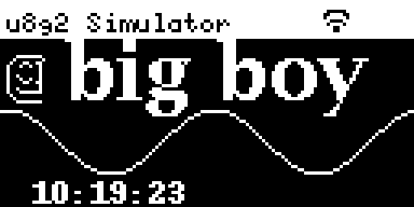

# U8G2 Python Simulator

This is a work in progress - many features untested, and API may change without warning!

A simple GUI simulator for the u8g2lib, useful when experimenting with LCD development. Rather than reflashing
your embedded system, you just get a window like this on screen:



That window is generated from this Python source code:

```
def draw(lcd):
    t = time.time()
    W, H = lcd.width, lcd.height
    lcd.clearBuffer()

    lcd.setFont("b10")

    # Header
    lcd.setDrawColor(1)
    lcd.drawBox(0, 0, W, 12)
    lcd.setDrawColor(0)
    lcd.drawStr(2, 10, "u8g2 Simulator")
    lcd.setDrawColor(1)

    # drawBitmap1 demo (packed 1-bpp)
    lcd.drawBitmap1(2, 16, 16, 16, SMILEY_16x16)

    # Change fonts
    lcd.setFont("lubB18")
    lcd.drawStr(20, 16, "big boy")

    # Default font
    lcd.setFont(None)

    # Optional file-based icon example
    lcd.setDrawColor(0)
    here = os.path.dirname(__file__)
    wifi_xbm = os.path.join(here, "small_wifi.xbm")
    if os.path.isfile(wifi_xbm):
        lcd.drawXBMfile(wifi_xbm, 100, 2)

    lcd.setDrawColor(1)

    # Sine wave animation
    mid = H//2 + 12
    prev = None
    for x in range(W):
        y = int(mid + 10*math.sin((x + t*60)*math.pi/32))
        if prev: lcd.drawLine(prev[0], prev[1], x, y)
        prev = (x, y)

    # Status text
    lcd.drawStr(10, H - 2, time.strftime("%H:%M:%S"))
    lcd.sendBuffer()
```

Features:

* Similar API to Arduino (or C/C++) for easy copying back & forth
* Automatically reloads source file for real-time development
* Loads BPF fonts automatically from your copy of u8g2 repository (converts to PIL format)
* Can save screenshot or animated GIF
* Adjustable aspect ratios to reflect hardware
* tkinter based, minimal Python3 requirements

Known Issues:

* Does not map font names to files

## Usage

### Quick Start

```
pip install pillow
git clone https://github.com/colinoflynn/u8g2-python-simulator.git
git clone https://github.com/olikraus/u8g2
cd u8g2-python-simulator
python3 u8g2_sim.py --u8g2-root ../u8g2 -f demo/demo_draw.py
```
Cloning u8g2 and pointing to it is optional, but if included the fonts from that repository will be used (otherwise a default font is used).

You can then open the `demo_draw.py` file in your preferred code editor. On saving the file you'll see changes reflected in the LCD simulator.

### Command Line Options

```
usage: u8g2_sim.py [-h] --file FILE [--width WIDTH] [--height HEIGHT] [--scale SCALE] [--aspect ASPECT] [--invert]
                   [--poll POLL] [--cache-size CACHE_SIZE] [--u8g2-root U8G2_ROOT]

Live-reloading u8g2-style LCD prototyper (with bitmap cache)

options:
  -h, --help               show this help message and exit
  --file FILE, -f FILE     Path to Python file providing draw(lcd) or demo_draw(lcd)
  --width WIDTH            LCD width in pixels (default 128)
  --height HEIGHT          LCD height in pixels (default 64)
  --scale SCALE            Base pixel scale (X axis) (default 6.0)
  --aspect ASPECT          Pixel aspect ratio Y/X (e.g., 1.116); if omitted, uses 1.0
  --invert                 Invert the display (white-on-black view)
  --poll POLL              Polling interval in ms for file changes (default 200)
  --cache-size CACHE_SIZE  Bitmap cache size (number of images)
  --u8g2-root U8G2_ROOT    Location of u8g2 root, used to find fonts
```

### Font Conversion/Caching

Fonts will be cached into a folder called `fontcache`. This will be relative to where you launch
the program from.